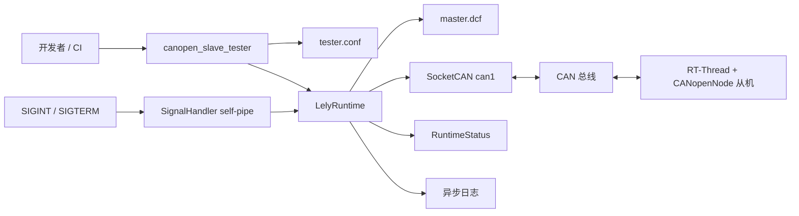

# CANopen Slave Tester

基于 Lely CANopen 的嵌入式 Linux 主站测试工具，用于验证运行在 MCU 上的 CANopenNode 从机。

当前版本聚焦 P0 工程基础和 P1 运行时：严格加载配置、初始化 SocketCAN 和 Lely `AsyncMaster`、观察从机 boot-up/NMT/heartbeat/CAN 状态，并提供可重复部署、日志和安全退出能力。NMT、SDO、PDO、SYNC、TIME、EMCY、LSS 的自动测试 Harness 将在后续阶段加入。

| 项目          | 当前值                                |
| ------------- | ------------------------------------- |
| 工具版本      | `0.3.0`                               |
| 当前阶段      | `P1-runtime`                          |
| CANopen 主站  | Lely CANopen `2.4.0`                  |
| 日志          | vendored spdlog `1.17.0`，Header-only |
| 目标平台      | Linux/aarch64，TQ8MP                  |
| 从机参考平台  | RT-Thread + CANopenNode，Node-ID 1    |
| 默认 CAN 接口 | `can1`，1 Mbit/s                      |

## 当前状态

- **P0 工程基础：已完成。** 交叉编译、本地配置隔离、目标板 Lely 运行库安装、部署脚本、配置校验和稳定退出码已经具备。
- **P1 运行时：实现完成，当前有条件通过。** 最新验证中 `configuration validated`、`Lely runtime is ready`、`boot node=1 ... status=success`、`can_state=active`、`can_errors=0`、`dropped_logs=0` 均正常；待补充修改后 MCU `Dropped.receive.packages` 增量为 `0` 的同轮证据后转为完全通过。
- **从机侧证据：** 此前的 `EMCY 0x8110` 已定位为批量 NMT 帧叠加逐帧 trace 导致的软件接收队列丢包；将 `reset_communication` 设为 `true` 后，启动流量由 Node-ID 2～126 的 125 帧定向复位变为单帧广播 `000#8200`，修改后日志未再出现 `0x8110`。

当前实测结论和原始日志摘录见 [P0/P1 验收结果与证据](docs/acceptance.md)。

## 功能概览

- 严格解析并校验 `config/tester.conf`，拒绝未知键、重复键、非法范围和空 DCF/EDS。
- 校验 SocketCAN 接口是否存在、标称波特率是否匹配，以及控制器是否处于可运行状态。
- 创建 Lely I/O context、poll、单线程 event loop、executor、timer、CAN channel 和 `AsyncMaster`。
- 加载 `master.dcf`，记录 CAN 状态、CAN 错误、heartbeat、NMT 状态和 boot-up。
- 采用有界异步日志队列和 `overrun_oldest` 策略，避免 Lely callback 被终端或文件 I/O 阻塞。
- 通过 POSIX self-pipe 将 `SIGINT`/`SIGTERM` 转换为普通线程上的停止请求。
- `Start()` 失败时按逆依赖顺序回滚，`Stop()` 幂等，并允许同一运行时对象执行多轮独立会话。
- 支持一键部署、远程运行和 `gdbserver` 调试。

## 快速开始

### 1. 准备本机构建配置

```sh
cp cmake/build_config.local.cmake.example cmake/build_config.local.cmake
```

编辑 `cmake/build_config.local.cmake`，填写 Yocto SDK、sysroot、Lely staged 头文件/库目录和目标板地址。机器相关路径不会写入版本库。

### 2. 生成主站 DCF

工程使用 Ubuntu 构建主机上的 Python 虚拟环境运行 `dcfgen`。首次安装、离线 wheel、环境修复和生成文件部署见 [dcfgen 安装与使用](docs/dcfgen-setup.md)。已有环境可从工程根目录运行：

```sh
source .venv-dcf-tools/bin/activate
cd config
dcfgen -r -v -d generated master.yml
cd ..
deactivate
```

不激活虚拟环境也可以直接运行：

```sh
cd config
../.venv-dcf-tools/bin/dcfgen -r -v -d generated master.yml
cd ..
```

P1 推荐保留以下 NMT 基线：

```yaml
master:
  start: false
  start_nodes: false
  start_all_nodes: false
  reset_all_nodes: false
  stop_all_nodes: false

mcu_node_1:
  boot: false
  mandatory: false
  reset_communication: true
```

`reset_communication: true` 允许 Lely 使用一帧广播 `000#8200`。不要改回 `false`，否则 Lely 为避开 Node-ID 1，可能逐个向 Node-ID 2～126 发送 `Reset Communication`，形成 125 帧启动突发。

详细字段、配置模板和生成结果检查见 [配置手册](docs/configuration.md)。

### 3. 编译

```sh
cmake -S . -B build
cmake --build build -j"$(nproc)"
```

输出：

```text
build/canopen_slave_tester
build/canopen_slave_tester.map
```

修改交叉编译器、目标架构、sysroot 或 Lely 路径后，应先删除旧构建目录：

```sh
rm -rf build
```

### 4. 安装目标板 Lely 运行库

首次部署前：

```sh
cp deploy/local.conf.example deploy/local.conf
chmod 600 deploy/local.conf
```

填写目标地址和宿主机上的 Lely 运行库归档路径，然后运行：

```sh
./deploy/install_lely.sh
```

正式产品应将 Lely 制作成 Yocto/DEB 软件包；该脚本面向受信任的开发调试网络。

### 5. 部署并运行

```sh
cmake --build build --target download
```

部署并启动 `gdbserver`：

```sh
cmake --build build --target debug
```

目标板手工运行：

```sh
cd /opt/Ultra/Debug/canopen-slave-tester
./bin/canopen_slave_tester --config config/tester.conf
```

按 `Ctrl-C` 请求正常退出。

## 文档

| 文档                                       | 内容                                              |
| ------------------------------------------ | ------------------------------------------------- |
| [文档首页](docs/index.md)                  | 按角色和任务导航全部文档                          |
| [入门教程](docs/getting-started.md)        | 从准备主机到完成首次 P1 运行                      |
| [配置手册](docs/configuration.md)          | `tester.conf`、`master.yml` 和生成结果检查        |
| [dcfgen 安装与使用](docs/dcfgen-setup.md)  | 创建虚拟环境、安装 dcf-tools、生成和部署 DCF      |
| [构建与部署](docs/deployment.md)           | 交叉编译、运行库安装、部署、远程调试              |
| [P0/P1 验收结果与证据](docs/acceptance.md) | 当前验收结论、日志证据和未闭环项                  |
| [设计文档](docs/design.md)                 | 架构、生命周期、线程模型、资源所有权和错误模型    |
| [API 文档](docs/api.md)                    | CLI、退出码和 C++ 公共接口                        |
| [故障排查](docs/troubleshooting.md)        | CAN 接收丢包、`0x8110`、DCF、SocketCAN 和部署问题 |

## 架构概览



详细设计见 [设计文档](docs/design.md)。

## 命令行

```text
Usage: canopen_slave_tester [options]

Options:
  --config PATH   Load runtime configuration from PATH.
  --check-config  Validate configuration and referenced files, then exit.
  --version       Print software and build dependency versions.
  -h, --help      Print this help text.
```

常用命令：

```sh
./canopen_slave_tester --version
./canopen_slave_tester --config config/tester.conf --check-config
./canopen_slave_tester --config config/tester.conf
```

## 配置和部署文件

| 本地文件                              | 作用                             | 目标板默认位置       |
| ------------------------------------- | -------------------------------- | -------------------- |
| `config/tester.conf`                  | 运行时、超时、路径和日志配置     | `config/tester.conf` |
| `config/master.yml`                   | `dcfgen` 网络描述源文件          | 仅构建主机使用       |
| `config/generated/master.dcf`         | Lely 主站对象字典和 NMT 启动策略 | `config/master.dcf`  |
| `config/project.eds`                  | 测试程序引用的从机 EDS           | `config/project.eds` |
| `config/generated/project.dcfgen.eds` | `dcfgen` 输入的从机 EDS          | 仅生成阶段使用       |

目标板默认根目录：

```text
/opt/Ultra/Debug/canopen-slave-tester
```

## P1 基线预期日志

启动：

```text
[info] [configuration] configuration validated
NMT: sending command specifier 130 to node 0
[info] [runtime] Lely runtime is ready
[info] [runtime] event loop started
[info] [canopen] boot node=1 state=0x0 status=success
```

退出：

```text
[info] [signal] SIGINT received
[info] [runtime] stop requested
[info] [runtime] event-loop shutdown started
[info] [runtime] event loop stopped after ... tasks
[info] [runtime] runtime resources released
[info] [runtime] session=... lifecycle=stopped can_state=active can_errors=0 dropped_logs=0 ...
```

不应出现：

```text
NMT: sending command specifier 130 to node 2
...
NMT: sending command specifier 130 to node 126
EMCY: received 8110 10
```

## 当前边界和后续阶段

P1 不包含交互式控制台、测试 Harness、测试报告生成，以及 NMT、SDO、PDO、SYNC、TIME、EMCY 和 LSS 自动用例。现有 `timeouts.*`、`console.history_path` 和 `console.report_directory` 为后续阶段保留，P1 仅负责加载和校验。

后续阶段应在不破坏 P1 生命周期和错误边界的前提下，逐步加入：

1. NMT 状态转换和 boot-up/heartbeat 自动断言；
2. SDO expedited/segmented/block 上传下载和 abort code 验证；
3. RPDO/TPDO 映射、事件定时器、同步传输和数据一致性；
4. EMCY、SYNC、TIME、heartbeat consumer、Node guarding 和 LSS；
5. 结构化测试报告、历史记录和可重复回归执行。
