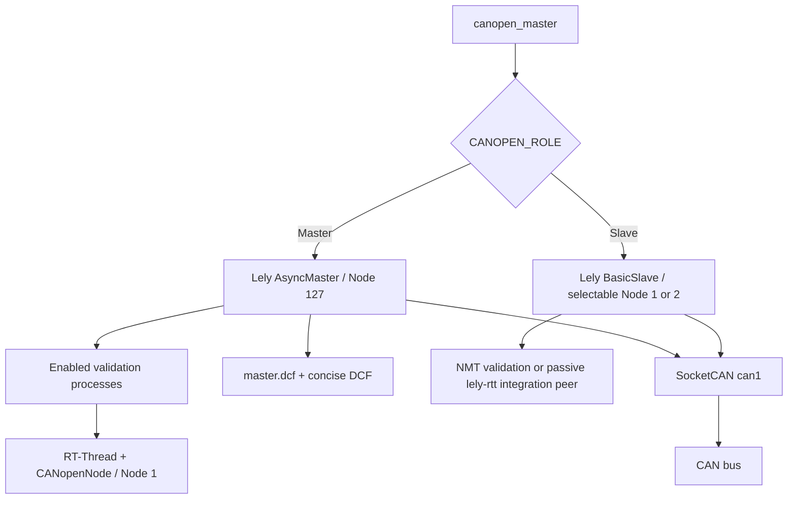

[中文](README.zh-CN.md)

# CANopen Slave Tester

[](https://github.com/wdfk-prog/canopen-slave-tester/actions/workflows/ci.yml)
[](https://wdfk-prog.github.io/canopen-slave-tester/)
[](https://github.com/wdfk-prog/canopen-slave-tester/releases)

CANopen Slave Tester is a Linux host-side CANopen protocol validation application built on Lely CANopen. It is used with an RT-Thread + CANopenNode MCU device to validate protocol behavior through standard CANopen services, observable Object Dictionary data, and bounded wire-level fixtures where a high-level Lely service is unavailable.

The deployed target is the TQ8MP Linux/aarch64 environment built with the project-specific Yocto SDK. CI reports Cppcheck results on a GitHub-hosted runner, while release builds use the real TQ8MP cross toolchain on a dedicated self-hosted runner.

## Features

- Lely `AsyncMaster` test role with configurable CANopen validation processes.
- Lely `BasicSlave` peer role with selectable CANopenNode sequence and lely-canopen-rtt B4 integration profiles.
- Heartbeat, SDO, PDO, SYNC, TIME, EMCY producer/consumer, storage, GFC, SRDO, and MCU SDO-client validation modules.
- Fail-fast ordered process execution and final Reset Communication cleanup.
- SocketCAN runtime with bitrate verification and asynchronous spdlog logging.
- TQ8MP Yocto cross-build/deploy workflow retained as the default build path.
- GitHub Actions CI with non-blocking Cppcheck reporting.
- GitHub Release CD that packages the TQ8MP/aarch64 executable, configuration, target Lely shared libraries, and SHA-256 checksum.
- Doxygen API documentation published through GitHub Pages.
- Bilingual maintained documentation under `docs/en/` and `docs/zh/`.

## Current default validation profile

The checked-in configuration uses `CANOPEN_ROLE_MASTER`. At present, `CANOPEN_ENABLE_SRDO_PROCESS=1`; the other automatic master-side validation processes are disabled by default. `CANOPEN_ENABLE_FINAL_RESET_PROCESS=1` remains enabled for shutdown cleanup.

These defaults are compile-time settings in the corresponding headers under `include/`. Enable only the processes supported by the connected MCU firmware and test fixture.

## Repository layout

```text
canopen-slave-tester/
├── .github/workflows/        # CI, TQ8MP Release CD, and Doxygen Pages
├── cmake/                    # TQ8MP/Yocto toolchain configuration
├── config/                   # Lely DCF/EDS and generated concise DCF files
├── deploy/                   # Target-board deployment helpers
├── docs/
│   ├── en/                   # Maintained English documentation
│   ├── zh/                   # Maintained Chinese documentation
│   └── examples/             # VS Code/GDB examples
├── include/                  # Compile-time config and module interfaces
├── src/                      # Lely runtime and validation processes
├── third_party/spdlog/       # Vendored spdlog 1.17.0
├── CMakeLists.txt
└── Doxyfile                  # Doxygen API documentation configuration
```

## Runtime model


```mermaid
flowchart TD
    App[canopen_master] --> Role{CANOPEN_ROLE}
    Role -->|Master| Master[Lely AsyncMaster / Node 127]
    Role -->|Slave| Peer[Lely BasicSlave / selectable Node 1 or 2]
    Master --> Processes[Enabled validation processes]
    Master --> DCF[master.dcf + concise DCF]
    Peer --> NMT[NMT validation or passive lely-rtt integration peer]
    Processes --> MCU[RT-Thread + CANopenNode / Node 1]
    Master --> CAN[SocketCAN can1]
    Peer --> CAN
    CAN --> Bus[CAN bus]
```

The master role owns one Lely CANopen channel. GFC and SRDO use a second fixed-purpose Lely `CanChannel` on the same SocketCAN interface for the wire-level frames that are not exposed through the Lely high-level CANopen API. This is not a generic raw-CAN interface.

## Target cross build

The default build path is unchanged and expects a local Yocto SDK plus a staged target build of Lely:

```sh
cp cmake/build_config.local.cmake.example cmake/build_config.local.cmake
# Edit the local file with your SDK/sysroot/Lely paths.

cmake -S . -B build -DCMAKE_EXPORT_COMPILE_COMMANDS=ON
cmake --build build --parallel
```

`cmake/build_config.local.cmake` and `deploy/local.conf` are developer-local files and are ignored by Git.

See [Getting started](docs/en/getting-started.md) and [Deployment](docs/en/deployment.md).

## CI, release, and API documentation

The release build runs on a self-hosted runner labeled `tq8mp-yocto`. The runner must have the real Yocto SDK and target-architecture Lely stage installed. Repository Actions variables provide their roots:

- `TQ8MP_YOCTO_SDK_ROOT`
- `TQ8MP_LELY_STAGE_ROOT`

A `v*` tag builds the target with the Yocto SDK and publishes `canopen-slave-tester-<tag>-tq8mp-aarch64.tar.gz` plus its SHA-256 checksum to GitHub Releases.

The generated Doxygen site is published at [GitHub Pages](https://wdfk-prog.github.io/canopen-slave-tester/). See [CI/CD](docs/en/ci-cd.md) for runner setup and release details.

## Validation modules

| Capability | Compile-time switch | Main implementation |
| --- | --- | --- |
| Heartbeat | `CANOPEN_ENABLE_HEARTBEAT_PROCESS` | `src/nmt_heartbeat.cpp` |
| SDO object access | `CANOPEN_ENABLE_SDO_PROCESS` | `src/sdo_process.cpp` |
| SDO server block transfer | `CANOPEN_ENABLE_SDO_BLOCK_PROCESS` | `src/sdo_block_process.cpp` |
| Storage persistence | `CANOPEN_ENABLE_STORAGE_PROCESS` | `src/storage_process.cpp` |
| MCU SDO client | `CANOPEN_ENABLE_SDO_CLIENT_PROCESS` | `src/sdo_client_process.cpp` |
| PDO | `CANOPEN_ENABLE_PDO_PROCESS` | `src/pdo_process.cpp` |
| SYNC / synchronous PDO | `CANOPEN_ENABLE_SYNC_PDO_PROCESS` | `src/sync_pdo_process.cpp` |
| TIME consumer | `CANOPEN_ENABLE_TIME_PROCESS` | `src/time_process.cpp` |
| EMCY producer | `CANOPEN_ENABLE_EMCY_PROCESS` | `src/emcy_process.cpp` |
| EMCY consumer | `CANOPEN_ENABLE_EMCY_CONSUMER_PROCESS` | `src/emcy_consumer_process.cpp` |
| GFC | `CANOPEN_ENABLE_GFC_PROCESS` | `src/gfc_process.cpp` |
| SRDO | `CANOPEN_ENABLE_SRDO_PROCESS` | `src/srdo_process.cpp` |
| NMT master behavior | `CANOPEN_ENABLE_NMT_MASTER_PROCESS` | `src/nmt_master_process.cpp` |

See [Testing and validation](docs/en/testing.md) for fixture and evidence boundaries.

## Documentation

- [Documentation index](docs/en/index.md)
- [Getting started](docs/en/getting-started.md)
- [Architecture](docs/en/architecture.md)
- [Configuration](docs/en/configuration.md)
- [Testing and validation](docs/en/testing.md)
- [CI/CD](docs/en/ci-cd.md)
- [Deployment](docs/en/deployment.md)
- [Troubleshooting](docs/en/troubleshooting.md)

## Important boundaries

- CI reports Cppcheck findings only; the TQ8MP release build is compile/link evidence, not target-board runtime or HIL verification.
- GFC/SRDO protocol tests do not establish SIL, PL, or functional-safety certification.
- Generated DCF/EDS files must remain synchronized with the MCU Object Dictionary when communication parameters change.
- The repository currently has no top-level project license file. The vendored spdlog tree retains its own license information; release packages reuse the target-architecture Lely stage configured on the TQ8MP build runner.
