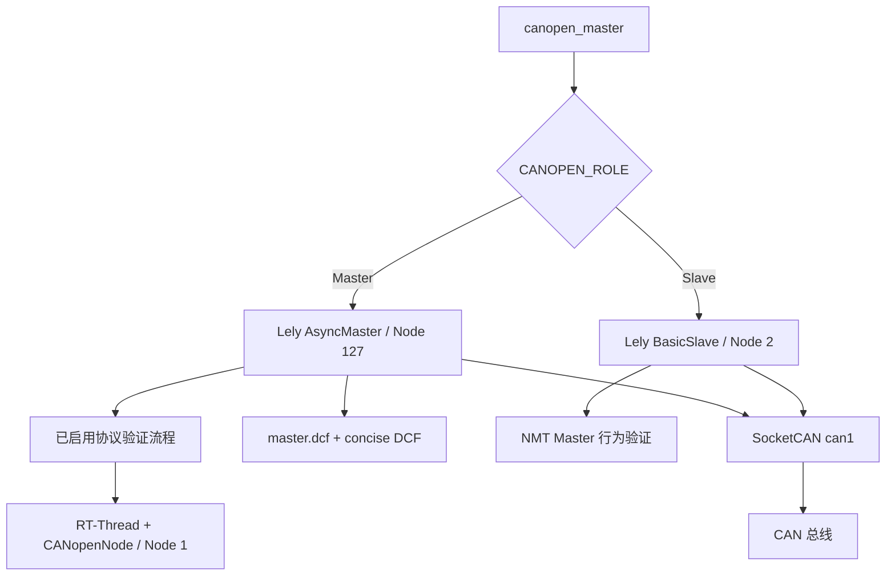

[English](README.md)

# CANopen Slave Tester

[](https://github.com/wdfk-prog/canopen-slave-tester/actions/workflows/ci.yml)
[](https://wdfk-prog.github.io/canopen-slave-tester/)
[](https://github.com/wdfk-prog/canopen-slave-tester/releases)

CANopen Slave Tester 是基于 Lely CANopen 的 Linux Host 侧 CANopen 协议验证程序，用于配合 RT-Thread + CANopenNode MCU，通过标准 CANopen 服务、可观察的 Object Dictionary 数据，以及少量高层 Lely API 未覆盖的固定 wire-level fixture 验证协议行为。

实际部署目标是使用项目 Yocto SDK 构建的 TQ8MP Linux/aarch64。CI 与 Release 构建都在专用 self-hosted GitHub Actions runner 上使用真实 TQ8MP Yocto SDK 交叉编译；tag 发布的是目标架构二进制，不再发布 GHCR 镜像。

## 功能特性

- 基于 Lely `AsyncMaster` 的测试主站角色，可按编译开关组合协议验证流程。
- 基于 Lely `BasicSlave` 的测试从站角色，用于验证 MCU 的 NMT Master 行为。
- 覆盖 Heartbeat、SDO、PDO、SYNC、TIME、EMCY producer/consumer、Storage、GFC、SRDO 和 MCU SDO Client。
- 固定顺序、fail-fast 的自动验证流程，以及退出时的 Reset Communication 清理。
- SocketCAN 运行时、bitrate 校验和 spdlog 异步日志。
- 保留 TQ8MP Yocto 交叉编译与部署方式作为默认构建路径。
- GitHub Actions CI：Cppcheck 非阻断报告 + 真实 TQ8MP Yocto 交叉编译。
- GitHub Release CD：发布 TQ8MP/aarch64 可执行文件、配置、目标 Lely 共享库和 SHA-256。
- Doxygen API 文档通过 GitHub Pages 发布。
- `docs/en/` 与 `docs/zh/` 维护中英文项目文档。

## 当前默认验证配置

仓库当前使用 `CANOPEN_ROLE_MASTER`。当前只有 `CANOPEN_ENABLE_SRDO_PROCESS=1`；其他 Master 自动验证流程默认关闭。退出清理 `CANOPEN_ENABLE_FINAL_RESET_PROCESS=1` 保持开启。

这些都是 `include/` 对应模块头文件中的编译期配置。只应启用当前 MCU 固件和测试夹具实际支持的功能。

## 仓库结构

```text
canopen-slave-tester/
├── .github/workflows/        # CI、TQ8MP Release CD 与 Doxygen Pages
├── cmake/                    # TQ8MP/Yocto 工具链配置
├── config/                   # Lely DCF/EDS 与生成的 concise DCF
├── deploy/                   # 目标板部署脚本
├── docs/
│   ├── en/                   # 维护中的英文文档
│   ├── zh/                   # 维护中的中文文档
│   └── examples/             # VS Code/GDB 示例
├── include/                  # 编译配置与模块接口
├── src/                      # Lely 运行时与验证流程
├── third_party/spdlog/       # vendored spdlog 1.17.0
├── CMakeLists.txt
└── Doxyfile                  # Doxygen API 文档配置
```

## 运行模型



Master 角色独占一条 Lely CANopen channel。GFC/SRDO 会在同一个 SocketCAN 接口上额外创建一条用途固定的 Lely `CanChannel`，仅用于 Lely 高层 CANopen API 未覆盖的协议 wire-level 帧；它不是面向其他模块开放的通用 Raw CAN 接口。

## 目标板交叉编译

默认构建路径不变，要求准备本机 Yocto SDK 和面向目标架构构建的 Lely stage：

```sh
cp cmake/build_config.local.cmake.example cmake/build_config.local.cmake
# 修改本机 SDK、sysroot、Lely 路径。

cmake -S . -B build -DCMAKE_EXPORT_COMPILE_COMMANDS=ON
cmake --build build --parallel
```

`cmake/build_config.local.cmake` 与 `deploy/local.conf` 属于开发机私有配置，已加入 Git 排除规则。

完整步骤见[快速开始](docs/zh/getting-started.md)和[部署](docs/zh/deployment.md)。

## CI、Release 与 API 文档

TQ8MP 编译检查和 Release 构建都运行在带 `tq8mp-yocto` 标签的 self-hosted runner。该 runner 必须安装真实 Yocto SDK 和目标架构 Lely stage，并在仓库 Actions Variables 中配置：

- `TQ8MP_YOCTO_SDK_ROOT`
- `TQ8MP_LELY_STAGE_ROOT`

推送 `v*` tag 后，CD 使用该 SDK 交叉编译，并把 `canopen-slave-tester-<tag>-tq8mp-aarch64.tar.gz` 与 SHA-256 文件上传到 GitHub Releases。

Doxygen 站点发布到 [GitHub Pages](https://wdfk-prog.github.io/canopen-slave-tester/)。self-hosted runner 和 Release 详细配置见 [CI/CD](docs/zh/ci-cd.md)。

## 验证模块

| 能力 | 编译开关 | 主要实现 |
| --- | --- | --- |
| Heartbeat | `CANOPEN_ENABLE_HEARTBEAT_PROCESS` | `src/nmt_heartbeat.cpp` |
| SDO object access | `CANOPEN_ENABLE_SDO_PROCESS` | `src/sdo_process.cpp` |
| SDO server block transfer | `CANOPEN_ENABLE_SDO_BLOCK_PROCESS` | `src/sdo_block_process.cpp` |
| Storage persistence | `CANOPEN_ENABLE_STORAGE_PROCESS` | `src/storage_process.cpp` |
| MCU SDO client | `CANOPEN_ENABLE_SDO_CLIENT_PROCESS` | `src/sdo_client_process.cpp` |
| PDO | `CANOPEN_ENABLE_PDO_PROCESS` | `src/pdo_process.cpp` |
| SYNC / synchronous PDO | `CANOPEN_ENABLE_SYNC_PDO_PROCESS` | `src/sync_pdo_process.cpp` |
| TIME consumer | `CANOPEN_ENABLE_TIME_PROCESS` | `src/time_process.cpp` |
| EMCY producer | `CANOPEN_ENABLE_EMCY_PROCESS` | `src/emcy_process.cpp` |
| EMCY consumer | `CANOPEN_ENABLE_EMCY_CONSUMER_PROCESS` | `src/emcy_consumer_process.cpp` |
| GFC | `CANOPEN_ENABLE_GFC_PROCESS` | `src/gfc_process.cpp` |
| SRDO | `CANOPEN_ENABLE_SRDO_PROCESS` | `src/srdo_process.cpp` |
| NMT Master behavior | `CANOPEN_ENABLE_NMT_MASTER_PROCESS` | `src/nmt_master_process.cpp` |

测试夹具、自动 PASS 与 HIL 证据边界见[测试与验证](docs/zh/testing.md)。

## 文档

- [文档索引](docs/zh/index.md)
- [快速开始](docs/zh/getting-started.md)
- [架构设计](docs/zh/architecture.md)
- [配置说明](docs/zh/configuration.md)
- [测试与验证](docs/zh/testing.md)
- [CI/CD](docs/zh/ci-cd.md)
- [部署](docs/zh/deployment.md)
- [故障排查](docs/zh/troubleshooting.md)

## 重要边界

- CI/Release 已使用 TQ8MP SDK 交叉编译，但仍不等价于目标板运行或 HIL 验证。
- GFC/SRDO 协议测试不构成 SIL、PL 或功能安全认证。
- 通信参数变化后必须同步 MCU Object Dictionary 与生成的 DCF/EDS。
- 当前仓库没有顶层项目 LICENSE 文件；vendored spdlog 保留其自身许可证；Release 包中的 Lely 共享库来自 TQ8MP build runner 配置的目标架构 Lely stage。
