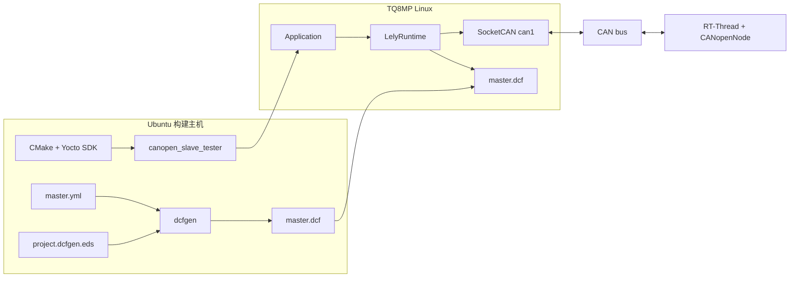
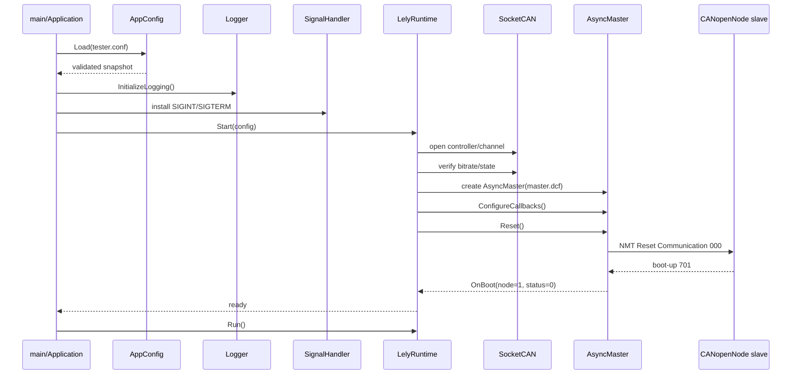
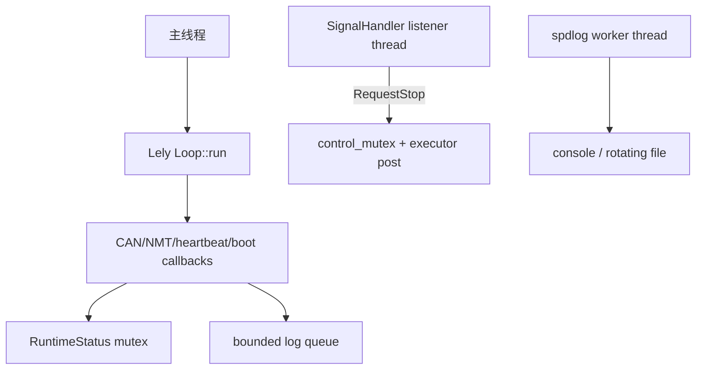
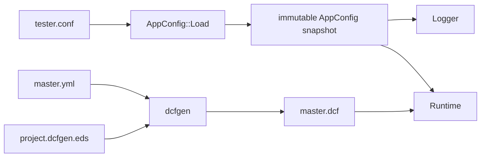

# P1 运行时设计

## 设计目标

P1 提供一个可复用、可观察且可安全停止的 Lely CANopen 主站运行时。它只负责建立可靠的通信基础，不在本阶段实现完整测试 Harness。

核心目标：

- 配置错误在创建运行时资源前被发现；
- SocketCAN 状态和波特率可验证；
- Lely 资源有明确所有权和销毁顺序；
- callback 不允许异常越过 C API/`noexcept` 边界；
- 信号处理满足 POSIX async-signal-safety；
- 日志 I/O 不阻塞 event loop；
- 启动失败可事务回滚，停止操作幂等；
- 每次运行会话都有一致的状态快照和稳定退出码。

## 系统边界



## 组件职责

| 组件            | 职责                                           | 不负责               |
| --------------- | ---------------------------------------------- | -------------------- |
| `main.cpp`      | 顶层异常边界和稳定退出码                       | 业务流程             |
| `Application`   | CLI、配置加载、日志会话、signal/runtime 编排   | Lely 资源细节        |
| `AppConfig`     | 严格 INI 解析、范围校验、路径解析、文件检查    | 动态重载             |
| `Logger`        | 分类异步日志、轮转文件、丢弃计数               | 测试报告             |
| `SignalHandler` | self-pipe 信号桥接                             | 直接销毁运行时资源   |
| `LelyRuntime`   | SocketCAN、Lely 资源、callback、生命周期和停止 | NMT/SDO/PDO 测试用例 |
| `RuntimeStatus` | 线程安全的会话状态快照                         | 持久化历史           |
| `deploy/*.sh`   | 运行库安装、文件上传、远程运行/调试            | 产品软件包管理       |

## 启动流程



`AsyncMaster::Reset()` 启动 Lely NMT master 状态机。`master.yml` 中 `reset_communication:true` 使当前拓扑使用单帧广播，而不是 125 帧定向复位。

## 运行时资源图

资源按依赖顺序创建：

```text
IoGuard
  └─ Context
      └─ Poll
          ├─ Loop
          │   └─ Executor
          ├─ Timer
          └─ CanChannel
              └─ CanController
                  └─ AsyncMaster
```

实际成员声明顺序：

```text
IoGuard → Context → Poll → Loop → Executor → Timer
→ CanController → CanChannel → AsyncMaster
```

清理严格按逆序执行：

```text
AsyncMaster → CanChannel → CanController → Timer
→ Executor → Loop → Poll → Context → IoGuard
```

在关闭 channel 前先调用 `context->shutdown()`，然后关闭 channel 并记录非致命 close 错误。

## 事务式 Start

`LelyRuntime::Start()` 使用局部 `StartRollback`：

1. 重置会话状态；
2. 逐步创建 Lely 和 SocketCAN 资源；
3. 任一步抛异常时，析构 guard 调用 `CleanupResourcesLocked()`；
4. 只有启动全部完成后调用 `Commit()`；
5. 成功后生命周期置为 `ready`。

该设计避免半初始化资源泄漏，并允许同一 `LelyRuntime` 对象在一次完整 `Stop()` 后再次 `Start()`。

## 线程模型



### 主线程

- 加载配置；
- 初始化日志和 signal handler；
- 创建并运行 Lely event loop；
- 运行结束后停止资源并输出最终快照。

### SignalHandler 线程

POSIX signal trampoline 只向非阻塞 pipe 写入 signal number。listener thread 读取后调用普通 C++ callback，避免在信号上下文中调用 mutex、分配器、日志或 Lely API。

### 日志 worker

所有分类 logger 共享预分配的有界队列。使用 `overrun_oldest`，避免 event-loop callback 等待慢终端或文件系统。覆盖数量通过 `DroppedLogCount()` 暴露。

### RuntimeStatus

一个常规 mutex 保护完整 `RuntimeStatusSnapshot`。涉及多个字段的逻辑事件通过复合 recorder 一次提交，避免读取到半更新状态。

## 停止流程

```mermaid
sequenceDiagram
    participant OS as SIGINT/SIGTERM
    participant Signal as Signal listener
    participant Runtime as LelyRuntime
    participant Exec as Lely executor
    participant Loop as Event loop
    participant App as Application

    OS->>Signal: signal
    Signal->>Runtime: RequestStop()
    Runtime->>Exec: post BeginShutdownOnLoop()
    Exec->>Runtime: lifecycle=stopping
    Runtime->>Loop: context.shutdown()
    Loop-->>App: run() returns
    App->>Runtime: Stop()
    Runtime->>Runtime: reverse-order cleanup
    Runtime-->>App: lifecycle=stopped
```

`RequestStop()` 和 `Stop()` 都是幂等的。若 `Stop()` 从其他线程调用且 loop 正在运行，它请求停止并等待 `Run()` 清除 running 状态。若从 event-loop 线程调用，只请求停止，避免自等待死锁。

## Callback 错误边界

Lely callback 注册为 `noexcept` lambda，并统一通过 `GuardCallback()` 执行：

- 正常事件写入 `RuntimeStatus` 并提交日志；
- `std::exception` 被转换为运行时失败记录；
- 未知异常也被捕获；
- 记录失败后停止 event loop；
- 异常不会跨过 callback 边界。

当前 callback：

| Callback      | 记录内容                                     |
| ------------- | -------------------------------------------- |
| `OnCanState`  | active/passive/bus-off/sleeping/stopped 变化 |
| `OnCanError`  | CAN error flags 和计数                       |
| `OnHeartbeat` | timeout occurred/recovered                   |
| `OnState`     | 节点 NMT state                               |
| `OnBoot`      | node、state、boot status 和 diagnostic       |

## 配置模型



运行时配置和网络 DCF 分离：

- `tester.conf` 决定“如何运行”；
- `master.yml`/`master.dcf` 决定“CANopen 网络如何启动和配置”。

这使 DCF 可以独立更新，但也要求部署前做文件一致性检查。

## 错误模型

顶层使用 `ApplicationError` 层级映射稳定退出码：

| 类型               | 类别        | 退出码 |
| ------------------ | ----------- | -----: |
| CLI 用法           | `USAGE`     |      1 |
| `ConfigError`      | `CONFIG`    |      2 |
| `SocketCanError`   | `SOCKETCAN` |      3 |
| `LelyRuntimeError` | `LELY`      |      4 |
| 未分类异常         | `INTERNAL`  |      5 |

失败时尽可能在日志 backend 仍有效时输出：异常类型、类别、退出码、会话号、生命周期、CAN 状态、CAN error 数、日志丢弃数、最后事件和最后异常。

## 可观察性

P1 的健康信号：

- startup 配置快照；
- 软件/Lely/spdlog 版本；
- `Lely runtime is ready`；
- event-loop 启停；
- boot/NMT/heartbeat/CAN 回调；
- 最终 session 状态摘要；
- 主机 `can_errors` 和 `dropped_logs`；
- MCU CAN 驱动 `Dropped.receive.packages` 增量。

主机 `can_errors=0` 不能代替 MCU 丢包计数。CAN 帧可能已经被硬件正确接收，但在 RT-Thread 软件队列中丢失。

## 安全和部署假设

- SSH host key 自动采集只适用于受信任的隔离调试网络；
- `deploy/local.conf` 和 `build_config.local.cmake` 包含机器信息，不应提交；
- 部署文件逐个激活，不是原子升级；
- Lely 安装脚本不是产品包管理方案；
- 运行时不提升权限，依赖目标环境已经允许访问 SocketCAN 和日志目录。

## 后续扩展原则

P2 及后续 Harness 应遵守：

1. 所有 Lely 操作在 event-loop executor 上串行化；
2. 测试命令不直接跨线程访问 `AsyncMaster`；
3. 每个异步操作有 timeout、结果对象和取消路径；
4. 测试状态与底层 `RuntimeStatus` 分离；
5. 报告生成不阻塞 event loop；
6. SDO/PDO 数据编码以 EDS 数据类型为准；
7. 失败不破坏 P1 的停止和资源回滚语义。
