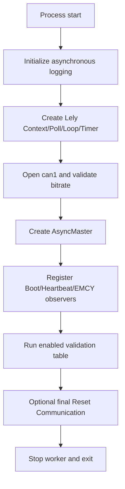
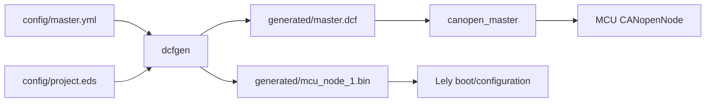

[中文](../zh/architecture.md)

# Architecture

## Roles

The executable has two compile-time Host roles selected by `CANOPEN_ROLE`:

- `CANOPEN_ROLE_MASTER`: Lely `AsyncMaster`, local Node-ID 127, drives the enabled validation processes against MCU Node 1.
- `CANOPEN_ROLE_SLAVE`: Lely `BasicSlave` with a selectable Node 1 lely-rtt B4 passive profile or Node 2 legacy CANopenNode NMT-sequence profile.

Both roles share the same SocketCAN/Lely event-loop setup and the same `canopen_master` executable target.

## Master execution flow

The validation table is built at compile time from the enable macros. Disabled processes do not occupy runtime entries. Execution is ordered and fail-fast through `canopenRunProcesses()`.

The process order in `src/main.cpp` is:

1. Heartbeat
2. SDO object access
3. SDO server block transfer
4. Storage persistence
5. MCU SDO client
6. PDO
7. SYNC/synchronous PDO
8. TIME consumer
9. EMCY producer
10. EMCY consumer
11. GFC
12. SRDO

Only enabled entries execute.

## Event-loop ownership

Lely I/O objects, CANopen objects, timers, and callbacks are owned by the process lifetime in `main.cpp`. A worker thread runs the Lely event loop; control-flow code waits on explicit callback evidence or bounded timeouts instead of polling raw CAN state directly.

Process modules own their test-specific constants and cleanup rules. Shared cross-process configuration stays in `include/canopen_config.h`.

## Wire-level fixture boundary

GFC and SRDO require CAN frames that are not exposed through the Lely high-level CANopen service API. When either process is compiled in, the Master role opens a second Lely `CanChannel` on the same `CanController`.

That channel is intentionally narrow in scope:

- GFC handles fixed CAN-ID `0x001` frames.
- SRDO handles only the configured SRDO pair/profile required by its validation fixture.
- The channel is shared sequentially by GFC/SRDO when both are enabled.
- It is not exposed as a generic raw-frame API to other validation modules.

## Configuration/data flow

Changes to baseline CANopen communication parameters should be made in the configuration sources and regenerated, not hidden as permanent test values inside a protocol process.

## Build-environment boundary

`CANOPEN_NATIVE_BUILD=ON` remains an optional local host-build mode only. CI performs Cppcheck only; Release uses the default TQ8MP cross-build contract with the project Yocto SDK and target Lely stage. Build-environment selection does not change CANopen roles, protocol logic, process ordering, Object Dictionary contracts, or runtime ownership.
