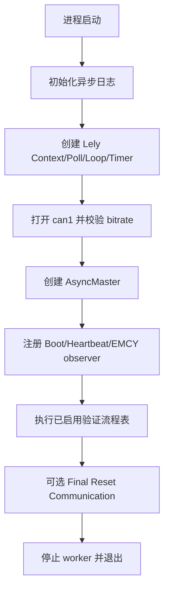
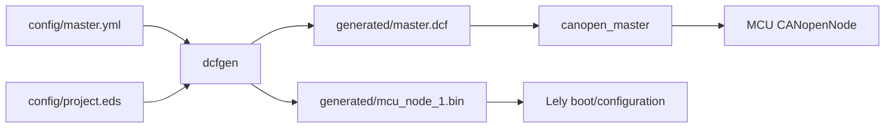

[English](../en/architecture.md)

# 架构设计

## Host 角色

可执行文件通过编译期 `CANOPEN_ROLE` 选择两种 Host 角色：

- `CANOPEN_ROLE_MASTER`：Lely `AsyncMaster`，本地 Node-ID 127，按启用配置驱动对 MCU Node 1 的协议验证。
- `CANOPEN_ROLE_SLAVE`：Lely `BasicSlave`，本地 Node-ID 2，作为标准 CANopen peer，由 MCU 发起 NMT Master 行为验证。

两种角色共用 SocketCAN/Lely event loop 初始化和同一个 `canopen_master` 构建 target。

## Master 执行流程

验证流程表由各模块 enable 宏在编译期决定。关闭的流程不会占用运行时表项；`canopenRunProcesses()` 按固定顺序 fail-fast 执行。

`src/main.cpp` 中的顺序为：

1. Heartbeat
2. SDO object access
3. SDO server block transfer
4. Storage persistence
5. MCU SDO client
6. PDO
7. SYNC/synchronous PDO
8. TIME consumer
9. EMCY producer
10. EMCY consumer
11. GFC
12. SRDO

只有实际 enable 的条目会执行。

## Event loop 与 ownership

Lely I/O 对象、CANopen 对象、Timer 和 callback 的生命周期由 `main.cpp` 统一管理。worker thread 运行 Lely event loop；测试控制逻辑通过 callback evidence 和有界 timeout 判断，而不是直接用 Raw CAN 轮询替代协议状态。

各协议模块只拥有自身测试常量、断言和 cleanup；跨模块共享配置保留在 `include/canopen_config.h`。

## Wire-level fixture 边界

GFC/SRDO 存在 Lely 高层 CANopen service API 未直接暴露的 wire-level 帧。只要二者任一被编译启用，Master role 就会在同一个 `CanController` 上额外打开第二条 Lely `CanChannel`。

该 channel 的职责被刻意限制：

- GFC 只处理固定 CAN-ID `0x001`；
- SRDO 只处理当前 SRDO profile 需要的成对帧；
- GFC/SRDO 同时启用时按流程顺序共享该 channel；
- 其他协议模块不能把它当通用 Raw CAN API 使用。

## 配置与数据流

基线 CANopen 通信参数应修改配置源并重新生成 DCF，而不是把永久配置隐藏到某个测试流程的运行期临时值中。

## 构建环境边界

`CANOPEN_NATIVE_BUILD=ON` 仅保留为可选的本机 Host 构建模式。CI 与 Release 使用默认 TQ8MP 交叉构建契约，直接依赖项目 Yocto SDK 与目标架构 Lely stage。构建环境选择不会改变 CANopen role、协议逻辑、流程顺序、OD 契约或运行时 ownership。
